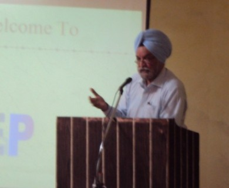

[About us](files/about.md) | [Members](files/members.md) | [Divisions](files/divisions.md) | [News](news.md) | 
 [Messages](files/messages.md) | [Gallery](gallery.md)

## IEI Ludhiana Local Centre
IEI Ludhiana Local Centre in the Service of Engineering Profession and Engineering Community. It functions with and amongst the professional engineers, academicians and researchers and provides a vast array of technical, professional and supporting services to the Government and the industries along with the academic and engineering communities.
Its main aim is to uplift and promote Engineering culture, discipline and its relevant practices.

### IEI Ludhiana Local Centre

IEI Ludhiana Local Centre in the Service of Engineering Profession and Engineering Community. It functions with and amongst the professional engineers, academicians and researchers and provides a vast array of technical, professional and supporting services to the Government and the industries along with the academic and engineering communities.

Its main aim is to uplift and promote Engineering culture, discipline and its relevant practices.

### Engineering Divisions of The Institution of Engineers (India)
The various Engineering Divisions established by The Institution of Engineers (India) are as under :

- Aerospace Engineering Division
- Agricultural Engineering Division
- Architectural Engineering Division
- Chemical Engineering Division
- Civil Engineering Division
- Computer Engineering Division
- Electrical Engineering Division
- Electronics and Telecommunication Engineering Division
- Environmental Engineering Division
- Marine Engineering Division
- Mechanical Engineering Division
- Metallurgical and Materials Engineering Division
- Mining Engineering Division
- Production Engineering Division
- Textile Engineering Division

### Chairman’s message 
It is a matter of extreme pride to head a prestigious chapter of the Institution of Engineers(India), the oldest body of engineers in the country. The Ludhiana local chapter boasts of a unparalleled legacy and I and my team for the 2024-26 shall strive hard to maintain this tradition. With your cooperation and support, we wish to hold a whole lot of technical activities. Our endeavour is to increase our member base and also ensure that Engineers associated with local chapter develop a sense of belonging and cooperate with each other for enhancement of technical collaboration. Let us all join hands to make our chapter a wonderful vibrant chapter.

Dr.ARVIND DHINGRA

Chairman

### Hon. Secretary’s message for website
In today’s fast paced wired world, internet has become the dynamic media for connecting with worthy members. This website of Institution of Engineers – Ludhiana Local Centre serves the purpose. The website has got the database for all our corporate members and also a glimpse of the last events hosted by the local chapter. It  provides a platform to engineering community to share their views and stay connected with the engineering fraternity across the globe. This facility  provides a deeper insight into the Institution’s working and will encourage the Corporate Members to work more for the benefit of Engineers. Through this website we aim to keep you updated with the latest happenings at Ludhiana Local Chapter

Er. Surinder Singh

Hony. Secretary

---
[Contact us](files/contact.md)
